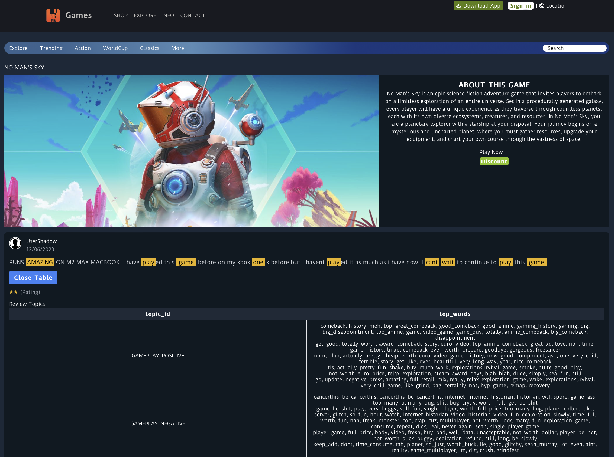

# NLP Approach for Video Game Playability Analysis Based on Players' Reviews
## Big Data Project - M.Sc. in Computer Science  
**Sapienza University of Rome**

## Project Overview

This project is inspired by the research paper titled:  
[A Data-Driven Approach for Video Game Playability Analysis Based on Players' Reviews](https://www.researchgate.net/publication/350121721_A_Data-Driven_Approach_for_Video_Game_Playability_Analysis_Based_on_Players%27_Reviews).

The focus of the project is to analyze the playability of video games using player reviews as the primary data source. By employing a data-driven approach, we aim to provide an objective and comprehensive evaluation of game playability. The concept of playability in this context is broken down into three key components, as defined by the Paavilainen framework:

- **Functionality**: The technical performance of the game, including the absence of bugs and issues.
- **Usability**: The ease of interaction with the game, including user interface design and user experience.
- **Gameplay**: The overall gaming experience, including mechanics, dynamics, and player engagement.

## Objectives

The primary goal of this project is to develop a simplified and explicit framework that enables an intuitive and quantifiable assessment of a game's overall playability. Additionally, the project aims to:

- Analyze both positive and negative aspects of the game based on user reviews.
- Classify review information into two main categories:
  - **Playability-informative**: Data that provides insights into the core aspects of playability (functionality, usability, gameplay).
  - **Non-playability-informative**: Data that does not directly contribute to the assessment of playability but may still be relevant for other purposes.

## Key Features

- **Data Collection**: Extraction and processing of player reviews from multiple sources.
- **Text Analysis**: Use of natural language processing (NLP) techniques to classify reviews.
- **Playability Metrics**: Development of custom metrics to score games based on their functionality, usability, and gameplay.
- **Visualization**: Graphical representation of the positive and negative aspects of the game, allowing for clear interpretation of the results.

## Conclusion

This project provides a novel approach to understanding video game playability through player reviews, helping developers and players alike gain deeper insights into what makes a game enjoyable and playable. The framework developed here could be extended to other types of user-generated content in the gaming industry or even beyond.

